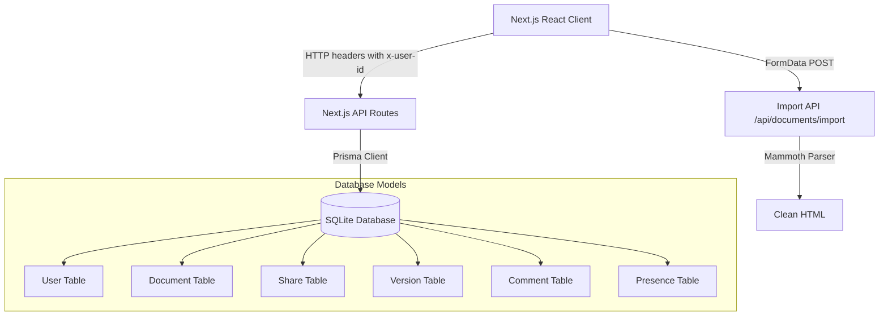

# Architecture Note: Ajaia Docs

This document outlines the technical design, architectural decisions, and key trade-offs made in the construction of Ajaia Docs.

---

## 🏛 Technical Stack Choices

1. **Next.js (App Router) & TypeScript**:
   Used as the full-stack foundation. App Router allows us to define clean APIs (server-side permission checks, version history, comments, and presence syncing) alongside highly responsive client-side React code.
2. **Prisma & SQLite**:
   Relational constraints (like `@@unique([documentId, userId])` on shares and presences) are critical for access-control integrity. SQLite allows reviewers to run this project instantly with zero-setup local database persistence, while Prisma provides typed queries and handles seed schema synchronization.
3. **TipTap (ProseMirror)**:
   Instead of writing an unstable custom editor with deprecated `execCommand` APIs, we integrated TipTap. It represents modern industry standards, scales to multi-user collaboration indicators, and styles beautifully with vanilla CSS.
4. **Vanilla CSS (Design Tokens & Glassmorphism)**:
   Following architectural styling guidelines, we avoided Tailwind CSS. We implemented a slate-dark UI utilizing modern CSS custom properties (`--primary`, HSL palettes), backdrop-filters, custom scrollbars, and micro-interactions.

---

## 🎯 Key Prioritizations & Product Trade-offs

### 1. Mock Authentication over Production Auth
- **Decision**: Implemented a header-driven `x-user-id` session switcher.
- **Rationale**: For an assessment under time pressure, configuring auth providers (Auth0/Clerk) complicates the review process. Our session-toggle dropdown in the sidebar allows a reviewer to switch between Alice (Owner), Bob (Editor), and Charlie (Commenter) instantly, seeing document permissions and commenting capabilities change dynamically in a single browser window.

### 2. Hybrid File Processing (Backend-driven)
- **Decision**: File imports (.txt, .md, and .docx) are posted as `FormData` to a serverless `/api/documents/import` endpoint.
- **Rationale**: While plain text files can be read on the client, parsing binary Word `.docx` documents requires a parser library like `mammoth`. To avoid heavy client-side bundler shim dependencies for file streams and native Node built-ins, processing uploads on the backend keeps the client bundle lightweight and robust. It returns clean HTML text which gets directly inserted at the active TipTap cursor position.

### 3. Depth in Collaboration Features
- **Decision**: Rather than broad, shallow page layouts, we built five advanced collaboration features:
  - **Contextual Comments**: Linked to editor text selections.
  - **Version snapshots**: Manual checkpoints and restoration.
  - **Exporting**: Raw Markdown downloader and custom `@media print` PDF stylesheet formatting.
  - **Collaboration Sync**: A short-polling sync engine tracking selection coordinates and cursors.
  - **Collaborator Simulator**: A client-side cursor generator to show multi-user editing instantly.
- **Rationale**: Document editing becomes significantly more valuable once multiple people can interact. Building these interactive loops demonstrates product-engineering maturity and full-stack execution capability.

### 4. Centered Sheet-Positioner Overlay
- **Decision**: Cursors are absolute-positioned inside a centered `.editor-sheet-positioner` container wrapper matching the sheet boundaries (`816px`) exactly.
- **Rationale**: Viewport-based cursor positioning breaks when resizing windows or opening sidebars. Positioning cursors relative to a wrapper matching the centered A4 sheet locks cursor coordinates exactly to the paragraphs they reference.
